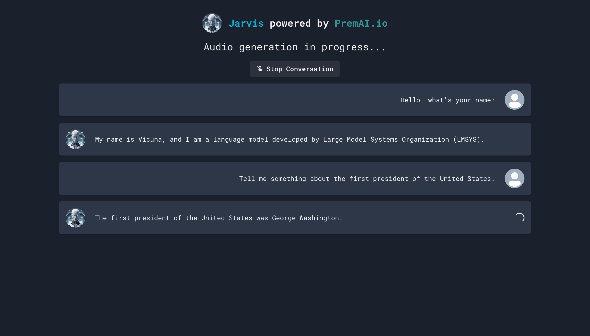

# Jarvis Chatbot with premAI.io

My submission for [Prem Challenge x LangChain](https://github.com/premAI-io/challenge-with-langchain)

I used:

- `Whisper Tiny` to convert audio to text
- `Bark` to convert text to audio
- `Vicuna 7B Q4` and `Dolly v2 12B` as language models

## How to set it up

- Download the project
- Run `npm install`
- Copy `.env.example` to `.env` and fill out the variables.
- Run `npm run dev`

## Examples

